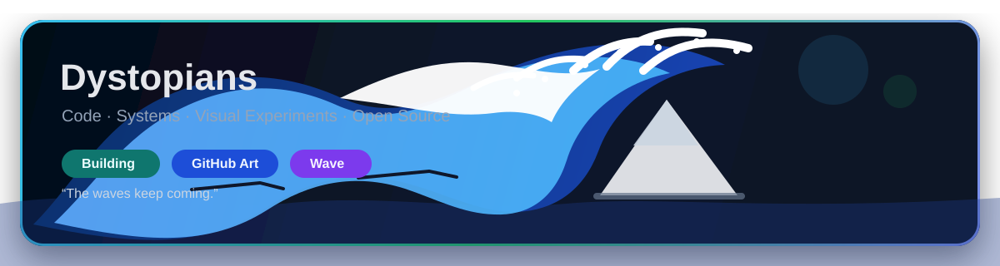

<p align="center">
  
</p>

<h1 align="center">Dystopians</h1>

<p align="center">
  Perception · Generation · Geometry · Quiet Systems
</p>

<p align="center">
  <a href="https://caipeilin.com/">
    
  </a>
  
  
  
</p>

---

## Drift

I build around the edge where **models stop recognizing the world and start reconstructing it**.

Some of my work lives in computer vision, some in language models, some in multimodal generation, and some in the spaces between them: sparse views becoming structure, memory becoming geometry, agents learning to move through scenes they barely understand.

This profile is only the surface. The full map is elsewhere.

<p align="center">
  <a href="https://caipeilin.com/">
    
  </a>
</p>

---

## Coordinates

```txt
signal     : vision, language, geometry, generation
terrain    : sparse observations, world models, embodied agents
instrument : code, experiments, memory, rendering
rule       : reveal enough to follow the trail, not enough to flatten it
```

<details>
  <summary>What I usually work on</summary>

- 3D reconstruction under sparse and imperfect observations
- Controllable generative rendering and camera-aware simulation
- Personalization, security, and evaluation for large language models
- Systems that bind perception, memory, and action into something navigable

</details>

<details>
  <summary>What is intentionally not mirrored here</summary>

The complete publication list, CV, contact route, institutional details, and the more literal biography are kept on the personal site.

</details>

---

## Telemetry

<p align="center">
  <a href="https://github.com/Dystopians">
    
  </a>
  <a href="https://github.com/Dystopians?tab=repositories">
    
  </a>
</p>
---

## Wake Pattern

<p align="center">
  
</p>

---

## Public Artifacts

| Artifact | Trace | Status |
|---|---|---|
| [SPCarNet](https://github.com/Dystopians/SPCarNet) | geometry, reconstruction, structure | Active |
| [mesh-](https://github.com/Dystopians/mesh-) | experiments near surfaces and form | Active |
| [Dystopians](https://github.com/Dystopians/Dystopians) | this profile, visual systems, README as interface | Ongoing |

---

## Trophies

<p align="center">
  
</p>

---

## Recent Motion

<!--START_SECTION:activity-->
<!--END_SECTION:activity-->

---

<p align="center">
  <i>"The waves keep coming. The map stays incomplete."</i>
</p>
